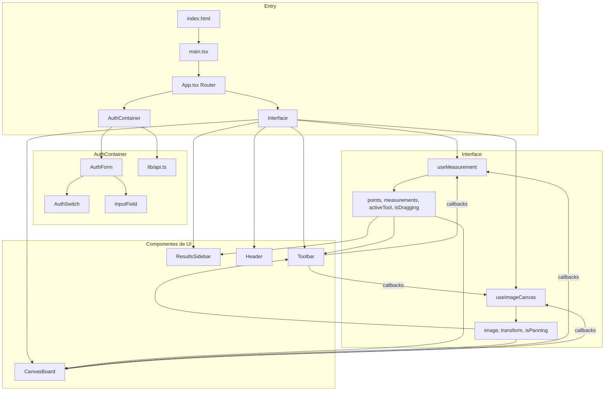
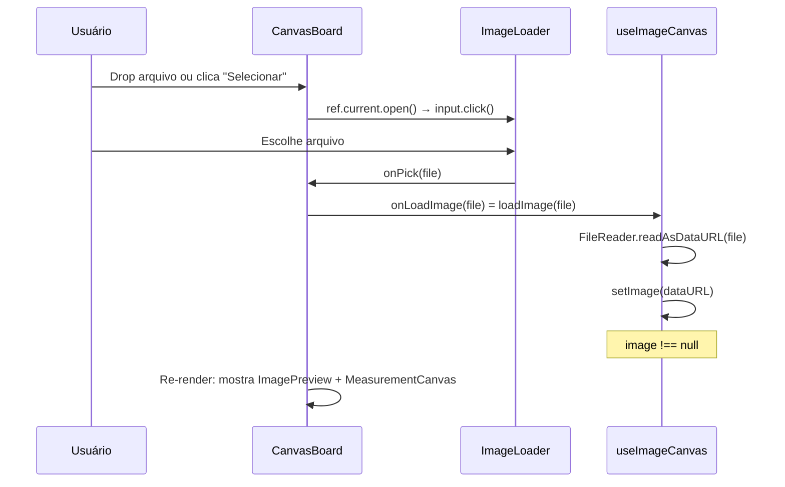
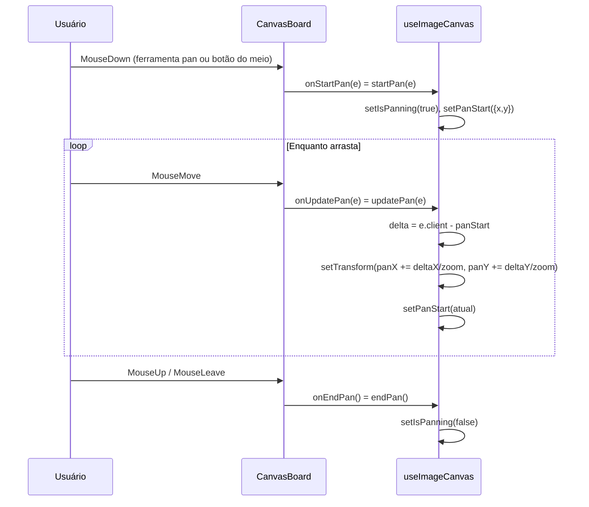
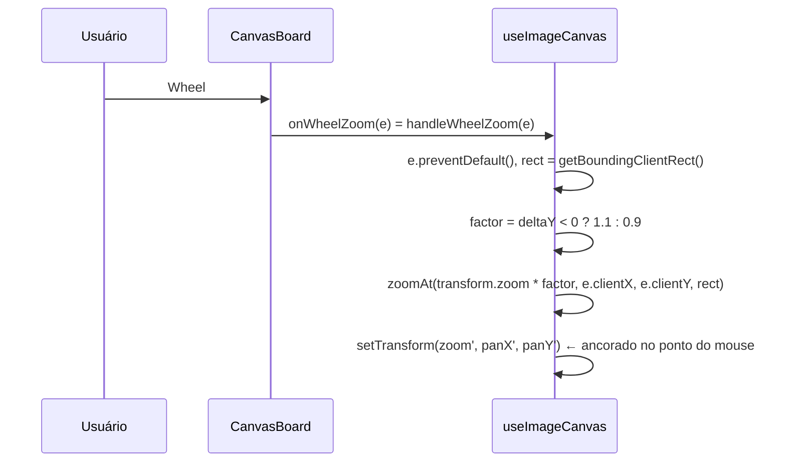
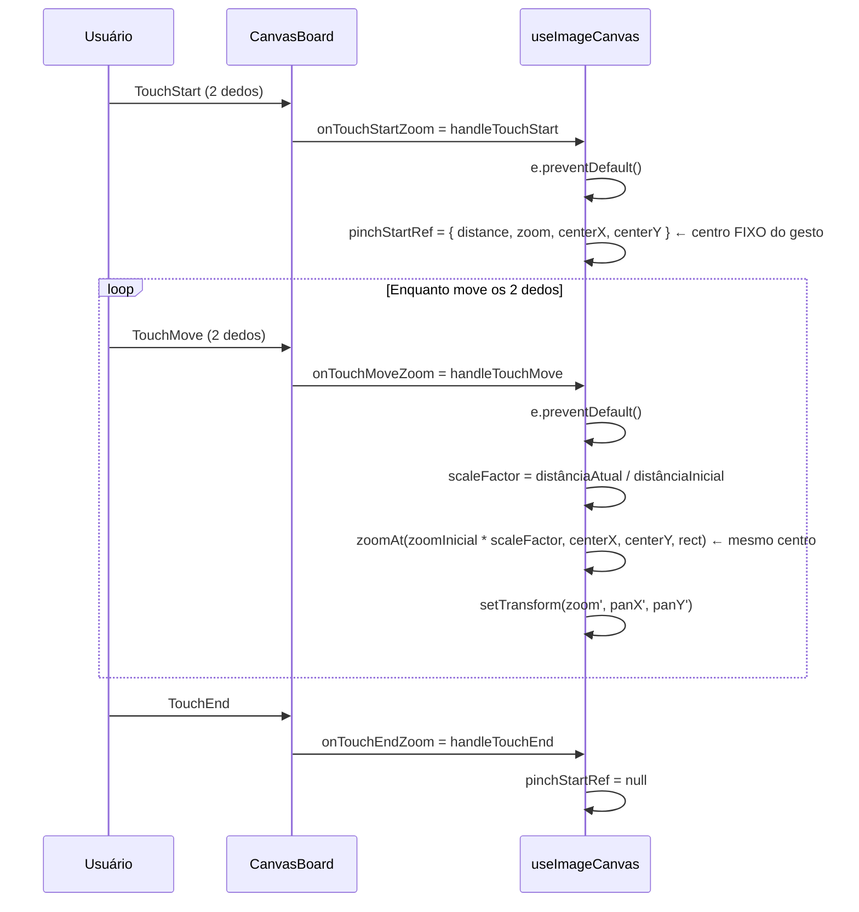
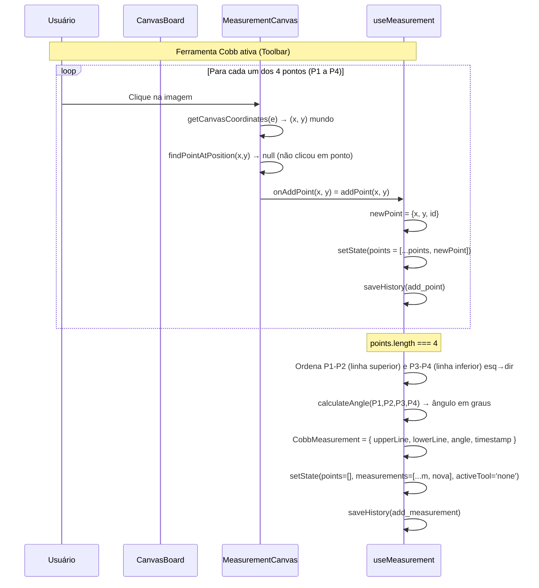
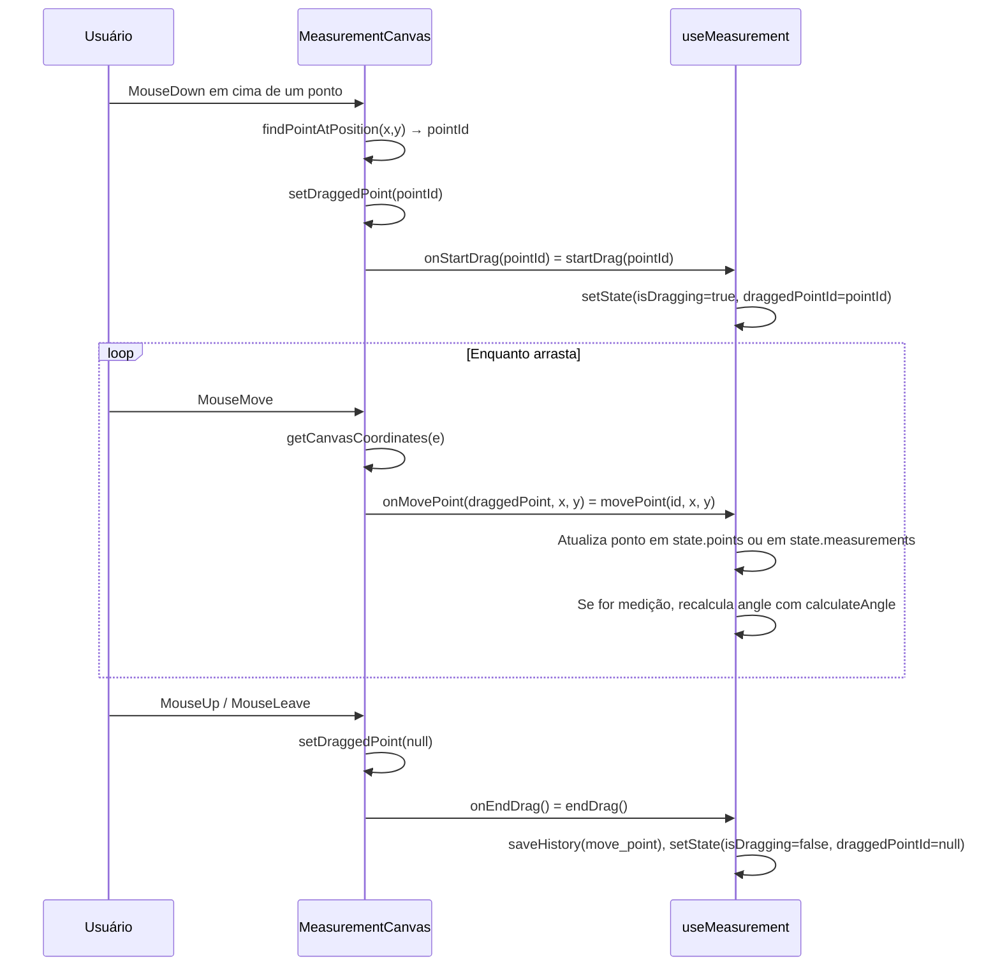

# OrtoMetric - Arquitetura e Fluxo

Este documento descreve a arquitetura atual do frontend e backend, com foco no fluxo de autenticacao e medicao.

---

## 1. Fluxo de entrada da aplicacao

```text
index.html
  -> main.tsx
  -> App.tsx (router)
      -> /login -> AuthContainer
      -> /      -> Interface
```

Resumo:

- `AuthContainer` orquestra login/cadastro.
- `Interface` orquestra medicao e canvas.

---

## 2. Visao geral por camadas



---

## 3. Fluxo de autenticacao (frontend -> backend)

```text
Usuario envia formulario (AuthForm)
    -> AuthContainer valida campos locais
    -> POST /auth/register (se modo cadastro)
    -> POST /auth/login
    -> salva access_token em sessionStorage
    -> redireciona para /
```

Backend:

```text
routes/auth.py
    -> schemas/user_schema.py (validacao)
    -> services/user_service.py (regra de negocio)
    -> models/user.py (persistencia)
```

Erros:

- 400 payload invalido
- 401 credenciais invalidas
- 500 erro interno

Logs:

- `register_success`
- `register_failed`
- `login_success`
- `login_failed`

---

## 4. Fluxo de medicao

### 4.1 Carregar imagem



**Arquivos:** `CanvasBoard.tsx` (drop/click → `onLoadImage`), `ImageLoader.tsx` (input file), `useImageCanvas.ts` (`loadImage` → `setImage`).

---

### 4.2 Pan (arrastar a imagem com o mouse)



**Observação:** `updatePan` só age se `!isDragging` (passado pelo useImageCanvas); assim, arrastar um ponto de medição não move a imagem.

---

### 4.3 Zoom (roda do mouse)



**Fórmula de ancoragem:** o ponto sob o mouse permanece fixo:  
`pan' = pan + (local - center) * (zoomAtual - zoomNovo)`.

---

### 4.4 Zoom por pinch (toque com dois dedos)



**Detalhe:** o centro usado em `zoomAt` é o **centro inicial** do pinch (guardado em `pinchStartRef`), não o centro atual entre os dedos, para a imagem não “deslizar” durante o gesto.

---

### 4.5 Medicao de Cobb (4 pontos -> angulo)



**Desenho:** `MeasurementCanvas` desenha os pontos e segmentos em um `<canvas>`; as coordenadas são convertidas com a mesma transformação (zoom, pan) da imagem. O estado (pontos e medições) vem de `useMeasurement`; o canvas só chama `onAddPoint` / `onMovePoint` / `onStartDrag` / `onEndDrag`.

---

### 4.6 Arrastar ponto de medicao



---

### 4.7 Undo / Redo

```mermaid
flowchart LR
    subgraph useMeasurement
        state[state]
        historyRef[historyRef: HistoryAction[]]
        historyIndexRef[historyIndexRef]
    end

    addPoint --> saveHistory
    addPoint --> setState
    movePoint --> setState
    endDrag --> saveHistory
    clearAll --> saveHistory

    undo --> historyIndexRef
    undo --> setState
    redo --> historyIndexRef
    redo --> setState

    saveHistory --> historyRef
    saveHistory --> historyIndexRef
```

- **Undo:** `historyIndexRef--`; aplica `action.previousState` em `setState`.
- **Redo:** `historyIndexRef++`; reaplica a ação (add_point, add_measurement, clear_all) em cima do estado atual.
- **Histórico:** cada `HistoryAction` guarda `type`, `payload` e `previousState` (snapshot antes da ação).

---

## 5. Onde cada coisa vive

| Item | Onde |
|------|------|
| Estado de auth (modo/formulario/erros) | `pages/AuthContainer.tsx` |
| Formulario de auth | `components/AuthForm.tsx` |
| Switch login/cadastro | `components/ui/AuthSwitch.tsx` |
| Campo reutilizavel | `components/ui/InputField.tsx` |
| Cliente HTTP com token | `lib/api.ts` |
| Pontos atuais (0–4) e medições de Cobb | `useMeasurement` → `state.points`, `state.measurements` |
| Ferramenta ativa, isDragging, draggedPointId | `useMeasurement` → `state` |
| Imagem (data URL) | `useImageCanvas` → `image` |
| Zoom, pan, brilho, contraste, invert | `useImageCanvas` → `transform` |
| isPanning, panStart | `useImageCanvas` |
| Pinch (distância/zoom/centro iniciais) | `useImageCanvas` → `pinchStartRef` |
| Histórico undo/redo | `useMeasurement` → `historyRef`, `historyIndexRef` |
| Desenho dos pontos/linhas/ângulos | `MeasurementCanvas` (canvas 2D, lê points/measurements via props) |
| Conversão tela ↔ mundo | `MeasurementCanvas` → `getCanvasCoordinates`, `toScreen` (no useEffect de desenho) |

---

## 6. Resumo do fluxo de dados

```text
Usuário → CanvasBoard / Toolbar / MeasurementCanvas
    → callbacks (onAddPoint, loadImage, startPan, …)
    → useMeasurement / useImageCanvas
    → setState / setTransform
    → re-render
    → novos props para os mesmos componentes
```

No auth, o mesmo principio vale: `AuthContainer` concentra estado e os componentes de UI apenas recebem props.
